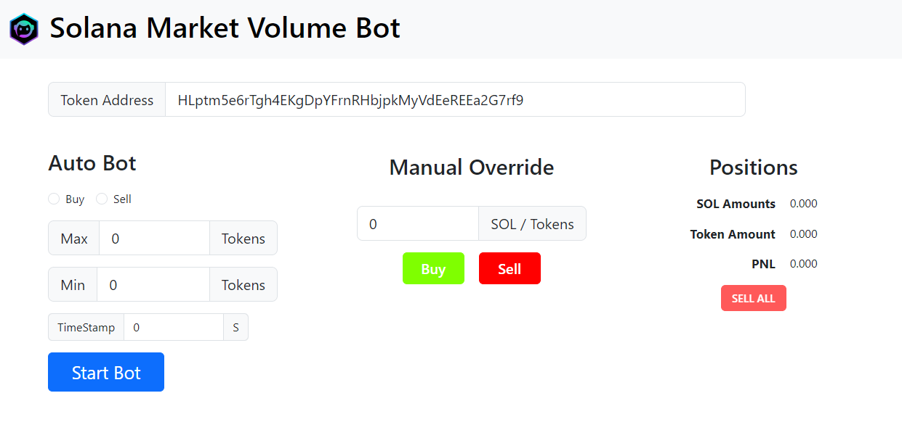
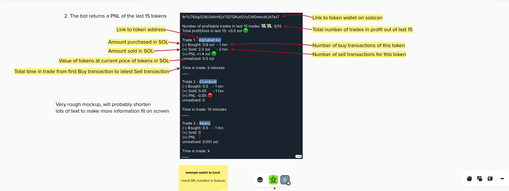
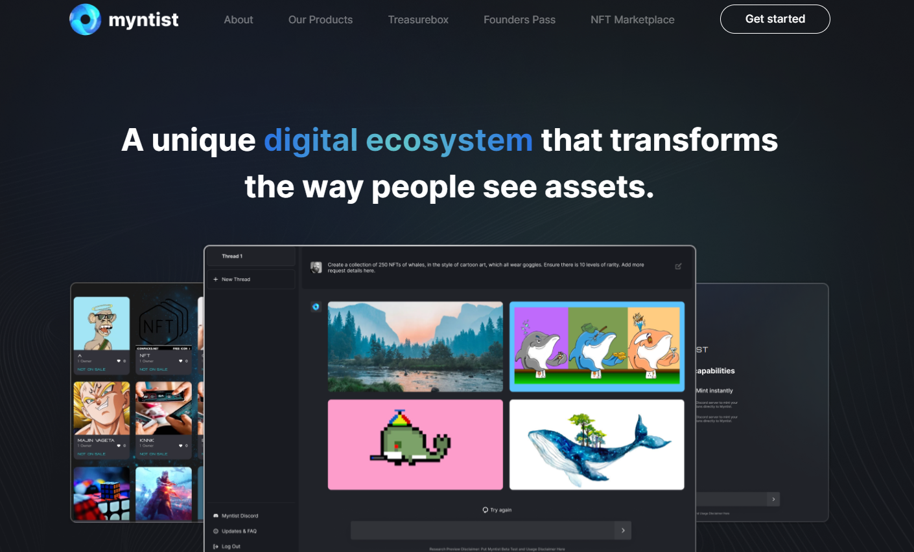
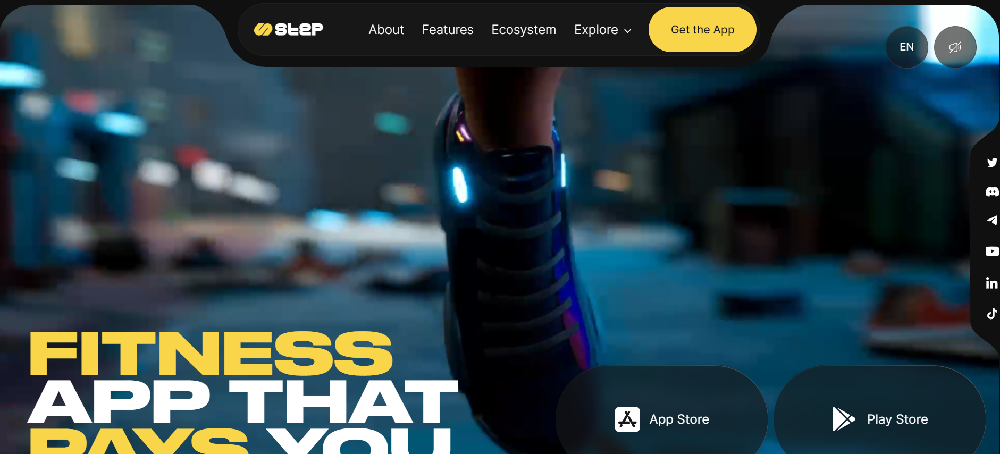
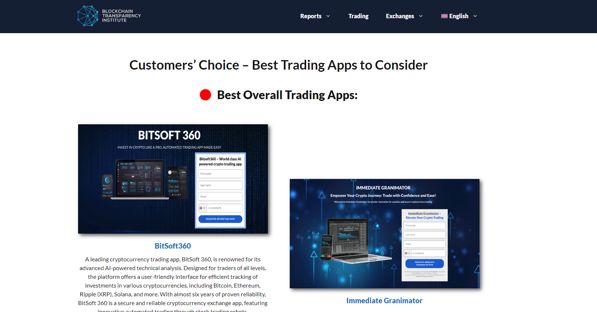
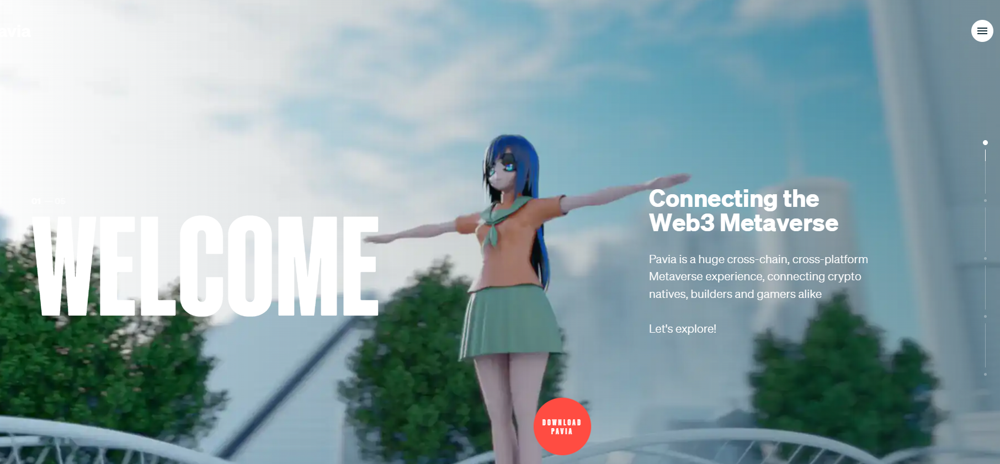
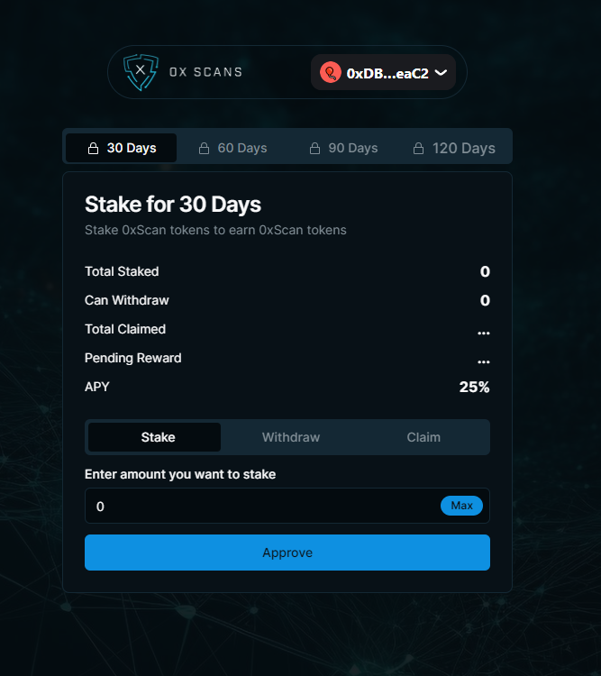
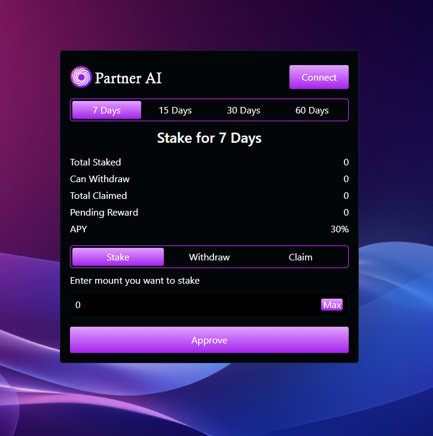
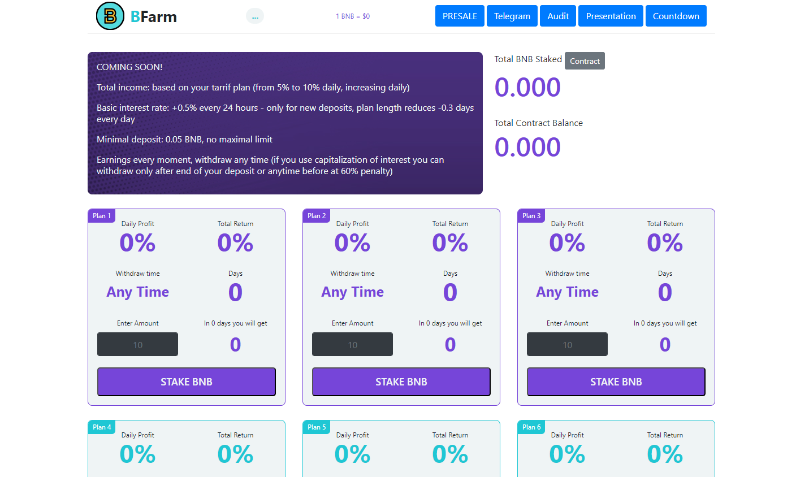
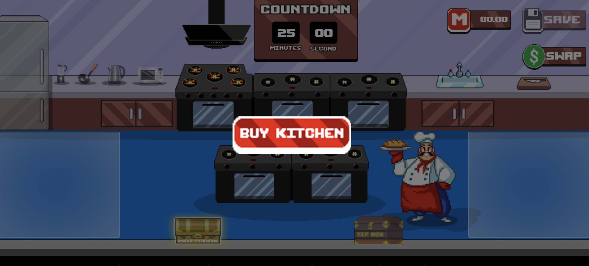

# Hello, I'm Stefan :wave:
I am an experienced and skilled full stack developer with a specialization in blockchain, smart contract development, and NFTs. With over 6 years of remote work experience, I have a proven track record of delivering successful projects.

In terms of front-end development, I am proficient in working with modern frameworks such as React and Vue. I have a deep understanding of responsive design principles and can create visually appealing applications that function seamlessly across various devices.

On the back-end, I have a strong command of Python and have utilized it to build robust and scalable applications. I am also well-versed in Next.js, React Native, Android (Java/Kotlin), Swift, and Flutter, enabling me to work on a wide range of platforms.

In addition to my technical skills, I have hands-on experience with popular UI libraries like Tailwind CSS and Material-UI. I have also leveraged cloud platforms like Google Firebase and Amazon Web Services (AWS) to develop applications that are both scalable and reliable.

My passion lies in the development of crypto bots and smart contracts. I thoroughly enjoy working with blockchain technology and have a deep understanding of the intricacies involved in creating secure and efficient systems.

I am committed to delivering high-quality solutions and leveraging my expertise to contribute to the success of your projects. Let's collaborate and create something truly remarkable!
<table>
  <tbody>
    <tr>
      <td>
        
      </td>
      <td>
        
      </td>
    </tr>
    <tr>
      <td>Market Volume Bot</td>
      <td>PnL Bot</td>
    </tr>
    <tr>
      <td>
        
      </td>
      <td>
        
      </td>
    </tr>
    <tr>
      <td>My Ntist</td>
      <td>Step App</td>
    </tr>
    <tr>
      <td>
        
      </td>
      <td>
        
      </td>
    </tr>
    <tr>
      <td>Trading website</td>
      <td>Pavia Metaverse</td>
    </tr>
    <tr>
      <td>
        
      </td>
      <td>
        
      </td>
    </tr>
    <tr>
      <td>Eth Staking DApp</td>
      <td>Sepolia Staking DApp</td>
    </tr>
    <tr>
      <td>
        
      </td>
      <td>
        
      </td>
    </tr>
    <tr>
      <td>BNB Staking DApp</td>
      <td>NFT Buy Kitchen Game</td>
    </tr>
  </tbody>
</table>

## Skills

Programming languages:

Graphics/GPU:

Mobile:

Web:

Software:

DataBase:

_Favorite programming language: Rust, Python, JavaScript, Three.js :crab:._  
_Learning: WebAssembly._  

